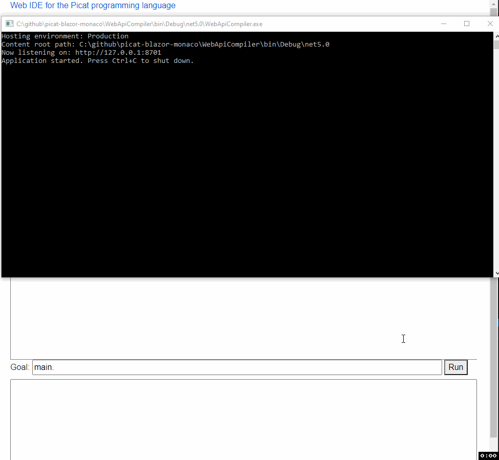

# picat-blazor-monaco
Web IDE for the Picat programming language based on Blazor and Monaco

This editor aims to aid in learning Picat syntax and editing Picat programs.

Some of the features provided by the editor:
- Syntax highlighting
- Code completion with documentation for the built-in APIs (CTRL+Space)
- Various standard editor features like indentation helpers, occurences highlighting, search, etc.
- Several pre-defined code examples
- Compilation/execution of code via the associated service
- You can define custom links to this editor by inserting your code as UrlEncoded value of the 'code' parameter like in the below example:
  https://localhost:5001?code=foo+%3D%3E+bar.%0D%0Abar+%3D%3E+println(hello).

The editor is based on 2 components:
1. The front-end page: this where the core editing experience resides. It's built using Blazor and Monaco, and runs using client-side WASM.
2. The Web Api compiler service. A thin wrapper around the Picat compiler command line program. It's task is to actually compile and run programs.
   Please note that you can still use the front end for basic editing even if you can't connect to a compiler service, however you will not be able to compile and run programs.

Caveats:
- Only tested on Windows. Though it's built on .net core, so should be possible to build for Linux/Mac with minimal or no code changes.
- Currently the Web API compiler service comes bundled with the Windows compiler - using on Linux/Mac would require the respective compiler version to be included.
- Currently the Web API compiler service is not safe to be exposed on the network where anybody can run arbitrary code on it. Please only use on localhost or on trusted networks.