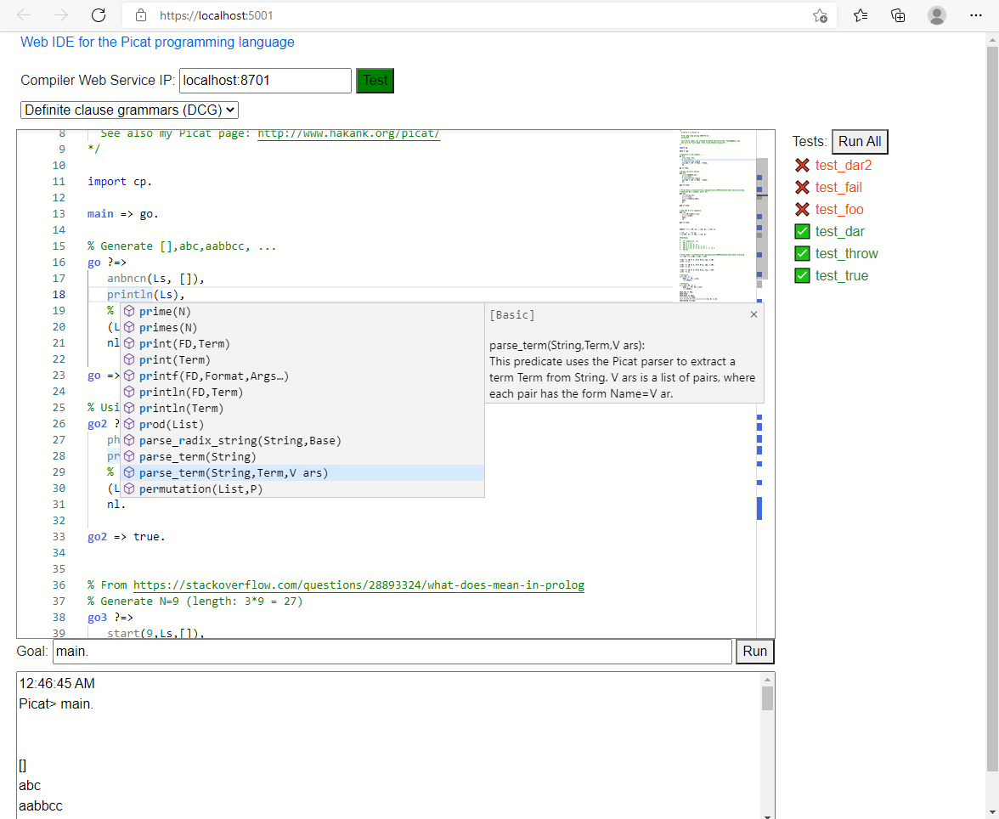

# picat-blazor-monaco-ide
Web IDE for the Picat programming language based on .net Blazor and Monaco

This editor aims to aid in learning Picat syntax and editing Picat programs.

## Live demo
The code editor, without the code compilation and execution server, is available on the below link. This portion of the IDE run completely client-side and will not send you code to the server. You can turn it into a complete IDE experience with syntax error highlighting, compilation, execution and test runner if you start the compiler web service component on your own machine.
https://andrzejolszak.github.io/picat-blazor-monaco-ide/PicatBlazorMonaco/publish/wwwroot/

## Features
Some of the features provided by the editor:
- Syntax highlighting
- Code completion with documentation for the built-in APIs (CTRL+Space)
- Various standard editor features like indentation helpers, occurences highlighting, search, etc.
- Several pre-defined code examples
- Compilation/execution of code via the associated service
- You can define custom links to this editor by inserting your code as UrlEncoded value of the 'code' parameter like in the below example:
  https://localhost:5001?code=foo+%3D%3E+bar.%0D%0Abar+%3D%3E+println(hello).

## Technical details
The editor is based on 2 components:
1. The front-end page: this where the core editing experience resides. It's built using Blazor and Monaco, and runs using client-side WASM.
2. The Web Api compiler service. A thin wrapper around the Picat compiler command line program. It's task is to forward code to the compile to compile and run programs.
   Please note that you can still use the front end for basic editing even if you can't connect to a compiler service, however you will not be able to compile and run programs.

## Caveats:
- Currently only tested on Windows. Though it's built on .net core, so should be possible to build for Linux/Mac with minimal or no code changes. If you want to contribute a non-Windows build or a Windows Docker image for the server, please send me a PR or a link to your builds.
- Currently the Web API compiler service comes bundled with the Windows compiler - using on Linux/Mac would require the respective compiler version to be included. Also the service implementation is very simple, it would be definitely possible to rewrite it in another language in an evening or two, if you wanted to do this.
- Currently the Web API compiler service is not safe to be exposed on the network where anybody can run arbitrary code on it. Please only use on localhost or on trusted networks.

## Running the IDE
- You can use the Live demo as is, and just start the compiler web service on your machine to get the full IDE experience
- Build the sources using VisualStudio and .net Core 5, and run from VS
- Run the attached Windows release binaries (only the editor server has to be Windows, the actual client machines used by developers can be other systems)

## Feature playground
The editor comes with an example that showcases the major features:

    % Welcome to the Picat editor based on Blazor and Monaco!
    % This editor aims to aid in learning Picat syntax and editing Picat programs.
    % Below you will get a step by step introduction to the available features.
    % The editor relies on a compiler service to do the actual compilation and code execution,
    % and to enable some of the features. Nevertheless, it is still possible to get a basic
    % editing experience without the service running.
    main => foo.
    
    % Syntax highlighting and basic operations:
    % The typical editing operations known from modern code editors are available, this includes:
    % copy-paste, undo, auto-intendation on Enter, selection highlighting, Alt+Shift+Click block editing, Ctrl+F search, etc.
    % You can try some of them by editing the below code:
    foo() => bar,
             bar, bar.
    
    % Code completion:
    % You can bring up the code completion options by pressing Ctrl+Space.
    % Documentation of most built-in functions is included,
    % and documentation for your own functions is taken from the comment preceding the declaration.
    % If the documentation is not displayed, you can open by clicking 'Read More' on the very right of a completion entry.
    % Try bringing up the completion for 'fo' to see it in action:
    foo2 => fo.
    
    % Built-ins hover documentation:
    % When it comes to built-in functions in existing code you can view their documentation either by:
    % - Ctrl+Space to bring their completion entry
    % - Mouse hover
    % You can try this below:
    bar => println(hello).
    
    % Go to declaration:
    % For your own functions, you can easily navigate to it's declaration by Ctrl+Click or the context menu.
    % Try going to 'foo' through the below code:
    car => foo.
    
    % Syntax error highlighting (requires compiler service):
    % Your code will get compiled in the background as you type, and also when you decide to run it.
    % Any syntax errors discovered will be market in red, and a hover tooltip to the code describing the error.
    % The compiler output will be shown in the output panel, and you can double click 
    % the '*** SYNTAX ERROR ***' message to quickly navigate to the target code fragment.
    % Please try it out on the below code, and use it to help you fix it.
    dar =>
        true :-) .
    
    % Code execution (requires compiler service):
    % You can run your program by supplying a goal, and clicking the Run button.
    % The output will be presented in the output panel.
    % Please note that the editor is not meant as a full-featured runner - you should always use you local Picat compiler for serious runs.
    % The editor runner limitations include: interactive user input is not supported, max execution time limited to 10s.
    % Give it a go by running the 'main' goal.
    
    % Unit tests (requires compiler service):
    % The editor provides a convention for defining unit tests:
    % they are argument-less predicates whose name starts with 'test_', and they can either succeed, fail, or throw.
    % Unit tests are a great way to gain confidence in the individual pieces of your program, and ensure that any refactorings
    % or additions of new features do not break the existing logic.
    % Tests are executed in a randomized order to prevent sequence-dependence, and their total execution time is limited to 15s.
    % Below you can find some example tests, press 'Run All' in the Tests panel to run them:
    test_foo => foo.
    test_true.
    test_fail => fail.
    test_dar() => dar.
    test_dar2() => this_do_not_exist(A, B, c, d).
    test_throw => X is 1/0.
    
    % Custom links:
    % If you want to share a code example link with someone, you can define a custom link to this editor
    % by inserting your code as UrlEncoded value of the 'code' parameter like in the below example:
    % https://localhost:5001?code=main+%3D%3E+bar.%0D%0Abar+%3D%3E+println(hello).
    
    % Reporting errors:
    % Please report any errors to the githu repository at: https://github.com/andrzejolszak/picat-blazor-monaco-ide
    % If possible, please include the contents of the JS console log after you have triggered the error (F12, or Developers tools in most browsers)
